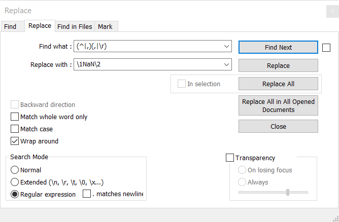

### Filling up NaNs in a csv table with Notepad++

- Open the csv text file with Notepad++
- Go to Search/Replace or press ctrl-H
- Click Wrap around
- Set Search Mode to Regular expression
- Search for: "(^|,)(,|\r)"
- Replace with: "\1NaN\2"
- If it does not work for the last column try \n or \r\n instead of \r

