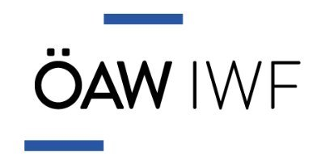
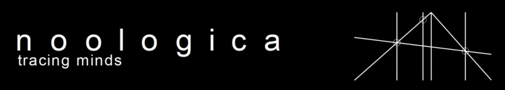

<link rel="shortcut icon" type="image/png" href="favicon.png">

<!-- -->

**ComsystanJ** (Complex Systems Analysis for ImageJ) is a collection of ImageJ2/Fiji plugins to compute the complexity, fractal dimension, entropy and other nonlinear measures of images and signals. It is recommended to use it with Fiji. Copyright (c) Comsystan Software. Developed and maintained by Helmut Ahammer.

### Downloads
- [Downloads](https://github.com/comsystan/comsystanj/releases)

### Installation
- Unzip the ComsystanJ-x.x.x.zip file and copy the folder to the Fiji's plugins folder 

### Project descriptions
- Processing 2D images [- Short description of plugins](description/img2-description.md) 

- Processing 3D images(volumes) [- Short description of plugins](description/img3-description.md) 

- Processing signals [- Short description of plugins](description/sig-description.md) 

### Citing ComsystanJ 

If you use ComsystanJ plugins and publish your work, please cite at least one of the following publications:

###### Image processing
- Ahammer, PLoS ONE, 2011, [https://doi.org/10.1371/journal.pone.0024796](https://doi.org/10.1371/journal.pone.0024796)
- Ahammer et.al., Chaos, 2015, [https://doi.org/10.1063/1.4923030](https://doi.org/10.1063/1.4923030)
- Mayrhofer-Reinhartshuber & Ahammer, Chaos, 2016, [https://doi.org/10.1063/1.4958709](https://doi.org/10.1063/1.4958709)
- Kainz et.al., PLoS ONE, 2015, [https://doi.org/10.1371/journal.pone.0116329](https://doi.org/10.1371/journal.pone.0116329)

###### Time series
- Müller et al., Scientific Reports, 2017, [https://doi.org/10.1038/s41598-017-02665-5](https://doi.org/10.1038/s41598-017-02665-5)
- Ahammer et al., Front.Physiol., 2018, [https://doi.org/10.3389/fphys.2018.00546](https://doi.org/10.3389/fphys.2018.00546)

### Collaborations

- [IWF](https://www.oeaw.ac.at/en/iwf) - The Space Research Institute IWF aims to study the physics of space plasmas and the atmospheres of planets inside and outside our solar system with advanced numerical models.

- [CAIMT](https://caimt.ro) - Research Center for Integrated Analysis and Territorial Management that aims to develop methods for advanced modeling of the complexity of territorial systems.

- [Noologica](https://noologica.com) - An open source initiative for the design, development, testing, validation and dissemination of a mental health research-diagnostic application.

- [MUG](https://medunigraz.at) - Medical University of Graz, Division of Biophysics

### Notes for using ComsystanJ with Fiji

**If image plugins do not work, select Edit/Options/ImageJ2..., activate "Use SCIFIO when opening files" and restart Fiji.**
  
It is recommended to use both ComsystanJ and Fiji with the same pom-scijava version number.
The pom-scijava version number of ComsystanJ can be viewed directly on the download site [Downloads](https://github.com/comsystan/comsystanj/releases).
To get the pom-scijava version number of your Fiji, simply start Fiji and execute following command in the search bar: `!ui.showDialog(app.getApp("Fiji").getPOM().getParentVersion())`

### Contact
Helmut Ahammer
e-mail **com.syst.an@gmail.com**
