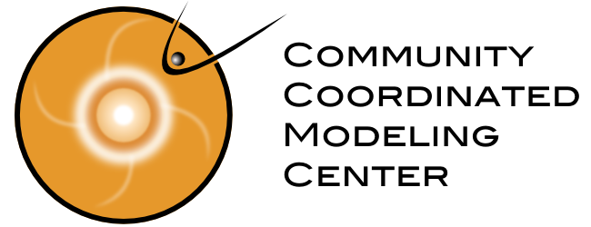

<link rel="shortcut icon" type="image/png" href="favicon.png">

<!-- -->

**ComsystanJ** (Complex Systems Analysis for ImageJ) is a collection of Fiji/ImageJ2 plugins to compute the complexity, fractal dimension, entropy and other nonlinear measures of images and signals. It is recommended to use it with Fiji. Developed and maintained by Helmut Ahammer.

### Downloads
- [Downloads](https://github.com/comsystan/comsystanj/releases)

### Installation
- Copy the ComsystanJ-x.x.x.jar file to the Fiji's plugins folder. Alternatively, the jar file can be imported using the Fiji command Plugins/Install. 

### Project descriptions
- 1D signals [- Description of 1D plugins](description/Description1DSignal.md) 
- 2D images [- Description of 2D plugins](description/Description2DImage.md) 
- 3D image volume [- Description of 3D plugins](description/Description3DVolume.md) 

### Citing ComsystanJ 
If you use ComsystanJ plugins and publish your work, please cite following publication:

Helmut Ahammer, Martin A. Reiss, Moritz Hackhofer, Ion Andronache, Marko Radulovic, Fabián Labra-Spröhnle, and Herbert Franz Jelinek. „ComsystanJ: A Collection of Fiji/ImageJ2 Plugins for Nonlinear and Complexity Analysis in 1D, 2D and 3D“. PLOS ONE 18, Nr. 10, 2023, e0292217, [https://doi.org/10.1371/journal.pone.0292217](https://doi.org/10.1371/journal.pone.0292217)

### Collaborations
  [CCMC](https://ccmc.gsfc.nasa.gov/) 
CCMC is a multi-agency partnership enabling, supporting, and performing research and development for next-generation space science and space weather models.
It is situated at NASA Goddard Space Flight Center [GSFC](https://www.nasa.gov/goddard)

 [CAIMT](https://caimt.ro) 
The Research Center for Integrated Analysis and Territorial Management aims to develop methods for advanced modeling of the complexity of territorial systems.

 [IORS](https://www.ncrc.ac.rs) 
The Institute for Oncology and Radiology of Serbia is a cancer clinic integrated with the National Cancer Research Centre as a research unit.

 [Noologica](https://noologica.com) 
An open source initiative for the design, development, testing, validation and dissemination of a mental health research-diagnostic application.

 [IASMS](https://iasms.org) 
The International Association of Sciences in Medicine and Sports is dedicated to scientific activities in all fields of medicine by maintaining health.

 [NISOS](https://nisos.at) 
Body composition analyses

 [MUG](https://medunigraz.at/en) 
Medical University of Graz, Division of Medical Physics & Biophysics

### Notes for using ComsystanJ with Fiji

**If image plugins do not work, select Edit/Options/ImageJ2..., activate "Use SCIFIO when opening files" and restart Fiji.**
  
**Signal plugins with Fiji <2.9.0 do not work.**

**Signal plugins with Fiji 2.9.0: check that the file scijava-plugins-io-table-x.x.x.jar in the jars folder is at least version 0.4.0.**

**Signal plugins with Fiji >2.9.0: scijava-plugins-io-table.jar file is obsolete.**

**It is recommended to use the latest Fiji version from the download archive [https://downloads.imagej.net/fiji/archive](https://downloads.imagej.net/fiji/archive). Updating is not mandatory.**

**Please note that updating an older Fiji version is sometimes not successful to get the latest version.**

It is recommended to use both ComsystanJ and Fiji with the same pom-scijava version number.
The pom-scijava version number of ComsystanJ can be viewed directly on the download site [Downloads](https://github.com/comsystan/comsystanj/releases).
To get the pom-scijava version number of your Fiji, simply start Fiji and execute following command in the search bar: `!ui.showDialog(app.getApp("Fiji").getPOM().getParentVersion())`

### Contact
Helmut Ahammer
e-mail **helmut.ahammer@medunigraz.at**
